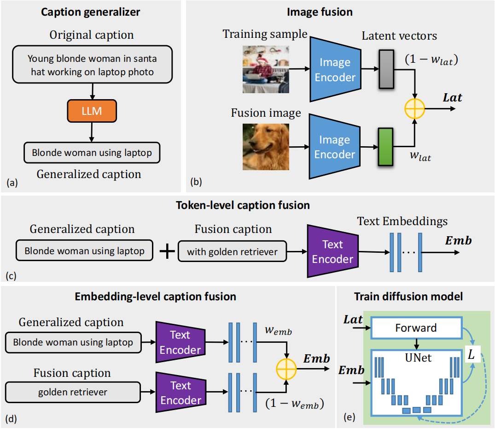
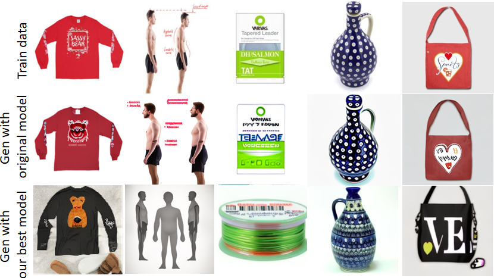

# Mitigate Replication and Copying in Diffusion Models with Generalized Caption and Dual Fusion Enhancement

This repo contains code for paper: Mitigate Replication and Copying in Diffusion Models with Generalized Caption and Dual Fusion Enhancement - [paper link](https://arxiv.org/pdf/2309.07254.pdf)






## Requirement

```
diffusers == 0.18.2
huggingface-hub == 0.14.1
img2dataset == 1.41.0
openai == 0.27.8
timm == 0.9.2
spacy == 3.6.0
torch == 1.13.0+cu116
torchvision == 0.14.0+cu116
transformers == 4.30.2
webdataset == 0.2.48
pytorch-fid == 0.3.0
```
We used an A100 to train the models and inference. Other machines may also fit, only need to adjust some parameters.

## GPT caption

```
python openai_api_sample.py
```

## Calculate generality

```
python generality.py
```

## Training the model

This is an example of w_lat=0.1 and caption embedding add with w_emb=0.5
```
accelerate launch --main_process_port 27000 diff_train.py --pretrained_model_name_or_path stabilityai/stable-diffusion-2-1 --instance_data_dir "./laion_10k_data_2" --resolution=256 --gradient_accumulation_steps=1 --center_crop --random_flip --learning_rate=5e-6 --lr_scheduler constant_with_warmup --lr_warmup_steps=5000 --max_train_steps=100000 --train_batch_size=16 --save_steps=10000 --modelsavesteps 20000 --duplication nodup --output_dir="./out_laion_10k_5_words_tiny_latent_0_1_embed_add_0_5" --class_prompt laion_orig --num_train_epoch 200 --use_clean_prompts --cat_object_latent --caption_add_method="embed_add" --latent_tiny_weight=0.1 --caption_tiny_weight=0.5

```

## Inference

```
python diff_inference.py --modelpath "./out_laion_10k_5_words_tiny_latent_0_1_embed_add_0_5_laion_orig_nodup/" -nb 8201 --GPT_caption "no"

```

## Retrieval

```
python diff_retrieval.py --arch resnet50_disc --similarity_metric dotproduct --pt_style sscd --dist-url 'tcp://localhost:10001' --world-size 1 --rank 0 --query_dir "./inferences/laion_10k_frozentext/out_laion_10k_5_words_tiny_latent_0_1_embed_add_0_5_laion_orig_nodup/laion_orig/" --val_dir "./laion_10k_data_2/"

python -m pytorch_fid ./laion_10k_data_2/raw_images ./inferences/laion_10k_frozentext/out_laion_10k_5_words_tiny_latent_0_1_embed_add_0_5_laion_orig_nodup/laion_orig/generations --device cuda

```

## Cite us

```
@article{li2023mitigate,
  title={Mitigate Replication and Copying in Diffusion Models with Generalized Caption and Dual Fusion Enhancement},
  author={Li, Chenghao and Chen, Dake and Zhang, Yuke and Beerel, Peter A},
  journal={arXiv preprint arXiv:2309.07254},
  year={2023}
}
```
